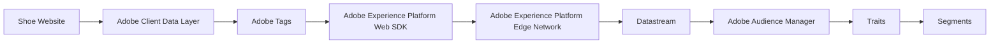

# Architecture

The React application owns the normalized internal event. `trackEvent.js` pushes it to `window.adobeDataLayer`, builds an ExperienceEvent-shaped XDM object, and delegates delivery to `adobeWebSdk.js`. In production, Adobe Tags should load/configure Alloy and can consume the data layer. The repository adapter is intentionally safe when Tags or Alloy are absent.

The only purchaser signal is the confirmation-page `purchase` event. A purchase ID is recorded in localStorage before dispatch, so refreshes do not produce a second purchase event.
